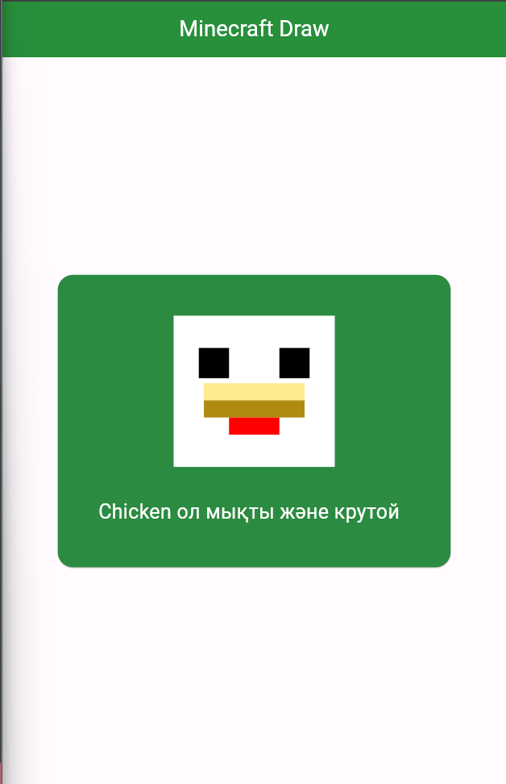

# minecraft_application

A new Flutter project.

## Getting Started

This project is a starting point for a Flutter application.

A few resources to get you started if this is your first Flutter project:

- [Lab: Write your first Flutter app](https://docs.flutter.dev/get-started/codelab)
- [Cookbook: Useful Flutter samples](https://docs.flutter.dev/cookbook)

For help getting started with Flutter development, view the
[online documentation](https://docs.flutter.dev/), which offers tutorials,
samples, guidance on mobile development, and a full API reference.

Это Chicken он крутой и оның еті халал қарның ашса жеуге болады өзім добро бердім смело балта мен бір удардан өледі иногда удачаң болса жұмыртқа береді .Шли удачаң масқара удачливыймын десең анау жұмыртқаны лақтырсаң жұмыртқадан балапан шығады ол бидайдың жемін жейді   s